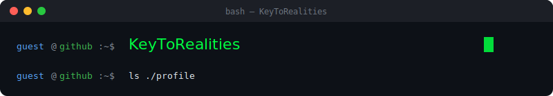

  

---

<pre>~/profile $ whoami</pre>

$\color{#BF00FF}{\textsf{KeysToRealities — Aspiring backend Java Web application Developer}}$

$\color{#BF00FF}{\textsf{Im open to network and willing to work to solve any problem or task..}}$
---

<pre>~/profile $ uptime
 up 3 years,  coding daily,  load avg: coffee, music, grind</pre>

---

<pre>~/profile $ ls -la skills/</pre>

**Languages**
<pre>
[ HTML         ] ██████████████░░  85%
[ CSS          ] █████████████░░░  80%
[ JavaScript   ] █████████████░░░  80%
[ Java         ] ████████████░░░░  75%
[ Python       ] ███████████░░░░░  70%
</pre>

**Frameworks**
<pre>
[ React        ] ████████████░░░░  75%
[ Next.js      ] ██████████░░░░░░  65%
[ Spring Boot  ] ██████████░░░░░░  65%
[ Flask        ] █████████░░░░░░░  60%
</pre>

**Tools & Environment**
<pre>
[ VS Code      ] ██████████████░░  85%
[ IntelliJ     ] ███████████░░░░░  70%
[ Eclipse      ] ██████████░░░░░░  65%
[ NetBeans     ] █████████░░░░░░░  60%
[ Ubuntu       ] ████████████░░░░  75%
[ Fedora       ] ██████████░░░░░░  65%
</pre>

<pre>~/profile $ cat skills/github-activity.log</pre>

  

---

<pre>~/profile $ ps aux | grep projects</pre>

| PID | PROJECT | STATUS | STACK |
|-----|---------|--------|-------|
| `001` | `project-one` | ▶ running | `Python` `React` |
| `002` | `project-two` | ▶ running | `Node` `MongoDB` |
| `003` | `project-three` | ⏸ paused | `[stack]` |

---

<pre>~/profile $ cat /etc/currently-learning.conf</pre>
<pre>[focus]
topic     = [e.g. Rust / System Design / AI]
resource  = [e.g. book, course, docs]
progress  = ████████░░░░  60%</pre>

---

<pre>~/profile $ ping -c 4 contact</pre>
<pre>PING contact (you) 56 bytes of data
64 bytes: GitHub   → github.com/KeysToRealities
64 bytes: Twitter  → @yourhandle
64 bytes: LinkedIn → linkedin.com/in/yourname
64 bytes: Email    → you@example.com

--- contact ping statistics ---
4 packets transmitted, 4 received, 0% packet loss</pre>

---

<pre>~/profile $ exit
logout
Connection to KeyToRealities closed.</pre>

---

  

